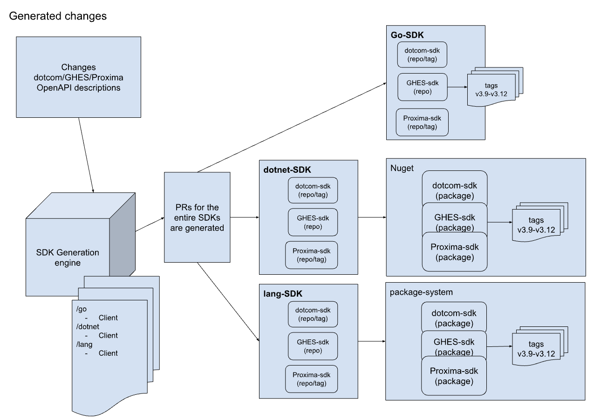
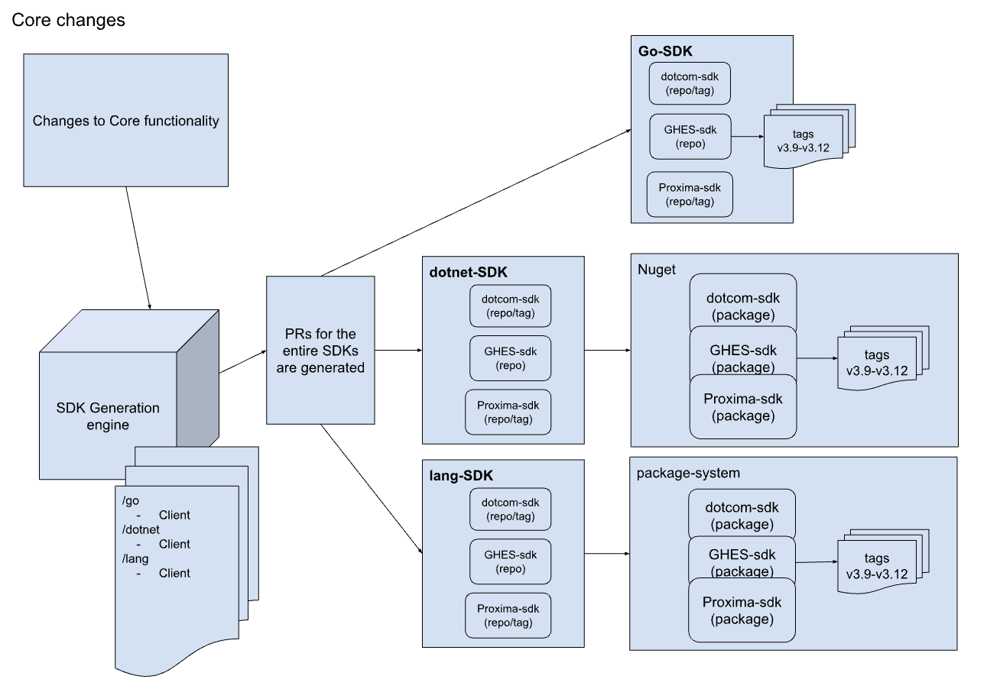
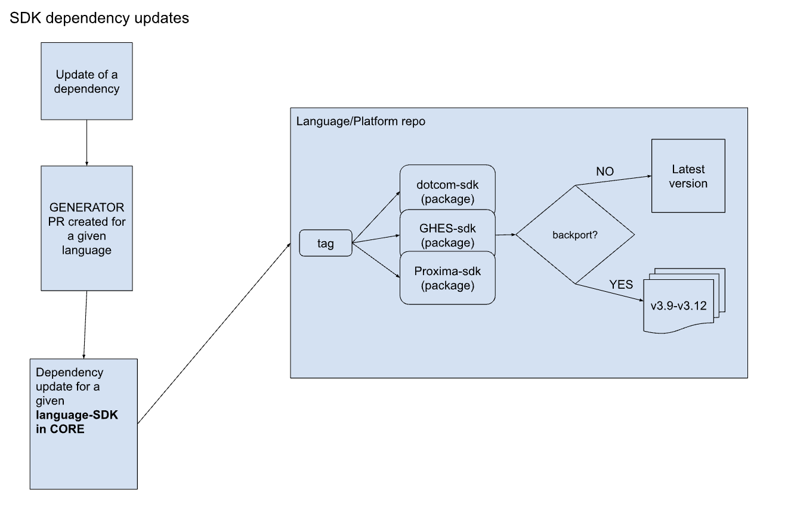

# Overview

Our goal is to create automation for generative SDKs beginning with Go and .NET that encompass all of GitHub's product offerings: GitHub.com, Enterprise Server, and Enterprise Cloud specifications.

## Acceptance criteria

Generated SDKs should...
- Abstract API implementations providing easy developer experience
- Enable users to easily make use of recommended auth patterns 
- Include client-side rate-limiting to make workflow execution more reliable
- Offer complete coverage of the REST API enabling more workflows
- Be an intuitive and discoverable developer experience
- Cover all supported versions of both GHES and Proxima
- Follow the deprecation policies of the GItHub API version at which they are targeted
- Follow a consistent naming scheme
- Have a patching plan for changes to the SDK outside of normal API specification updates (e.g. in case of necessary security updates or backports)

## Overall our design choice should…
- Work well with our versioning needs
- Be reasonable to manage and maintain by the SDK team and our awesome contributors
- Make the default use case simple to use, understand, and easily differentiated at a glance from the base generative SDK offering

## Approach

### Use the generator to propagate language SDKs, storing the core implementation for each language in the generator itself

_These changes represent the product of code generated from [GitHub's OpenAPI](https://github.com/github/rest-api-description) definitions via [Mirosoft Kiota](https://github.com/microsoft/kiota)._

### Process flow for generation
1. OpenAPI changes are detected from each API representation
2. Generator creates the SDKs and ships them to their respective language repos (i.e. dotnet-sdk, go-sdk) and PRs against main
3. Packages are manually created and tagged appropriately

------

_These changes represent the "core" aspects of each SDK.  These resources consist of middleware, authentication, request and client factories, and other code that is not generated using Kiota. Often, this source is handwritten once, copied to the individual languages' and platforms' staging directories, and then propagated when generating the SDKs for a given GitHub platform._

### Process flow for changes/additions to SDK client/core
1. Feature is added to all language versions of the SDK in the generator
2. PRs are created for all language / platform combinations
3. All updates are tagged and shipped
    1. If we are considering backporting the feature then we will cherry pick and multiply it x the number of supported GHES versions.

------

_These changes represent any external resources or libraries used by the SDKs. In general, the intention is to keep the utilization of external libraries to a minimum to reduce deviations in the source across languanges. This also helps the developer experience of SDKs remain consistent across languages and platforms._

### Process flow for dependency updates to SDK client/core 
1. Dependency is updated for a given language in the GENERATOR for core
    1. Note: Dependencies for Generated code (i.e. Kiota) will get updated when generation happens
2. A Dependency PR is created in each language/platform repo - this is done via [dependabot](../.github/dependabot.yml) for all workflows and source alike.
3. All updates are shipped - tags created (no backport on dependencies unless critical / security issues)
    1. For one language this means that code is changed in the GENERATOR only.
    2. If backporting is necessary, a cherry pick in the SDK repos will be required.

## Naming

### Goals

1. Respect the language idioms
2. Use GitHub and community aware monikers and domain language 
    - SDK = Software Development Kit
    - GHES = GitHub Enterprise Server  

### Package names 

- **Owner.Brand.Platform**
- **Owner.Brand.Platform.Version**

#### .NET
- GitHub.Octokit.SDK
- GitHub.Octokit.GHEC.SDK
- GitHub.Octokit.GHES.SDK.3.10
- GitHub.Octokit.GHES.SDK.3.11

#### JAVA
- com.GitHub.Octokit.SDK
- com.GitHub.Octokit.GHES.SDK.3.12
- com.GitHub.Octokit.GHEC.SDK

#### Python
- github_octokit_sdk
- github_octokit_ghec_sdk
- github_octokit_ghes_sdk_3_12

### Repo names pattern 

- **Languange.Platform**

#### Go
- go-sdk
- go-sdk-enterprise-server
- go-sdk-enterprise-cloud

#### .NET
- dotnet-sdk
- dotnet-sdk-enterprise-server
- dotnet-sdk-enterprise-cloud

